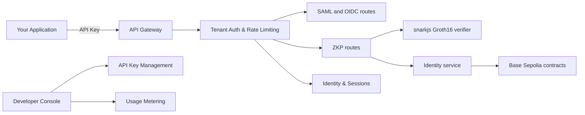

# Architecture

ZeroAuth is a hosted authentication API platform with multi-tenant isolation, zero-knowledge proof verification, optional blockchain anchoring, and enterprise federation support.

## Core Components

### API Gateway & Tenant Isolation

Every API request is authenticated via a scoped API key (`za_live_*` or `za_test_*`). The gateway:

- validates the API key via SHA-256 hash lookup,
- checks required scopes for the endpoint,
- loads the tenant context (plan, limits, status),
- enforces per-tenant sliding window rate limiting,
- enforces monthly quota limits,
- logs usage for metering,
- sets rate limit response headers.

### Identity Service

Handles registration-time identity generation:

1. computes `SHA-256(biometricTemplate)`,
2. generates a DID of the form `did:zeroauth:base:<32-hex-chars>`,
3. derives a Poseidon-based `biometricSecret`,
4. derives a Poseidon `commitment`,
5. derives a Poseidon `didHash`,
6. registers `biometricIDHash -> DID` on-chain when blockchain integration is enabled.

The raw biometric template is processed in memory and immediately discarded.

### ZKP Verifier

Verification behavior:

- validates request shape,
- enforces a five-minute timestamp window,
- validates the nonce format as UUID v4,
- expects exactly three public signals,
- runs off-chain Groth16 verification using `snarkjs`,
- optionally runs on-chain contract verification.

### Blockchain Service

Connects to Base Sepolia L2 using `ethers` and manages:

- the `DIDRegistry` contract (identity anchoring),
- the `Groth16Verifier` contract (on-chain proof verification),
- identity registration transactions,
- blockchain status reporting.

### Session and Token Layer

Authentication results produce:

- a JWT access token (1h default),
- a JWT refresh token (7d default),
- a session record tracking `sessionId`, `userId`, `provider`, and expiry.

### Developer Console

REST API for account management:

- account signup and authentication,
- API key creation, listing, and revocation,
- usage monitoring and monthly history,
- account and plan information.

Console endpoints use JWT session tokens (24h expiry), separate from API keys.

## Route Layout

### Versioned API (requires API key)

- `GET /v1/auth/zkp/nonce` — generate proof nonces
- `POST /v1/auth/zkp/register` — register biometric identities
- `POST /v1/auth/zkp/verify` — verify ZK proofs
- `GET /v1/auth/zkp/circuit-info` — circuit metadata
- `GET /v1/auth/saml/login` — initiate SAML SSO
- `POST /v1/auth/saml/callback` — process SAML assertions
- `GET /v1/auth/saml/metadata` — SP metadata
- `GET /v1/auth/oidc/authorize` — initiate OIDC flow
- `POST /v1/auth/oidc/callback` — process OIDC callbacks
- `GET /v1/identity/me` — user profile
- `POST /v1/identity/logout` — session invalidation
- `POST /v1/identity/refresh` — token refresh

### Developer Console (requires console token)

- `POST /api/console/signup` — create account
- `POST /api/console/login` — authenticate
- `GET|POST|DELETE /api/console/keys` — key management
- `GET /api/console/usage` — usage stats
- `GET /api/console/account` — account info

### Public

- `GET /api/health` — service health (no auth required)

## Contract and Circuit Boundary

The cryptographic and blockchain pieces are intentionally separated:

- the Circom circuit proves knowledge of `biometricSecret` and `salt`,
- the API verifies proofs and manages sessions,
- the blockchain stores only the biometric hash to DID mapping and, optionally, verifies proof tuples on-chain.

See [Contracts and Circuit](../reference/contracts-and-circuit.md) for contract ABI and circuit details.
